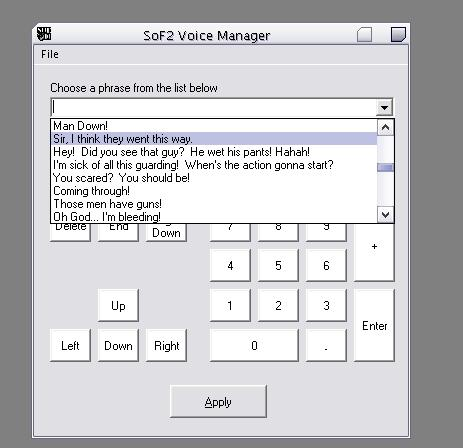



## Soldier Of Fortune 2 \- Voice Manager

### Description

To be used with the PC game Soldier of Fortune 2 - Double Helix.

This program lets the user play 64+ new radio messages in-game. Readme explains the rest. You need SoF2 in order to use this. I don't know how many of PSC's users play games, but I thought what the heck, I'll submit this prog that I made for the SoF2 community just in case anyone wanted the source.
 
### More Info
 
that you have sof2 installed :)

if you have sof2 installed, it will copy the new pk3 file to your sof2 directory.

             |
---                |---
**Submitted On**   |2002-07-04 19:23:18
**By**             |[SeeD](https://github.com/Planet-Source-Code/PSCIndex/blob/master/ByAuthor/seed.md)
**Level**          |Intermediate
**User Rating**    |4.0 (16 globes from 4 users)
**Compatibility**  |VB 5\.0, VB 6\.0
**Category**       |[Games](https://github.com/Planet-Source-Code/PSCIndex/blob/master/ByCategory/games__1-38.md)
**World**          |[Visual Basic](https://github.com/Planet-Source-Code/PSCIndex/blob/master/ByWorld/visual-basic.md)
**Archive File**   |[Soldier\_Of102020742002\.zip](https://github.com/Planet-Source-Code/seed-soldier-of-fortune-2-voice-manager__1-36579/archive/master.zip)

